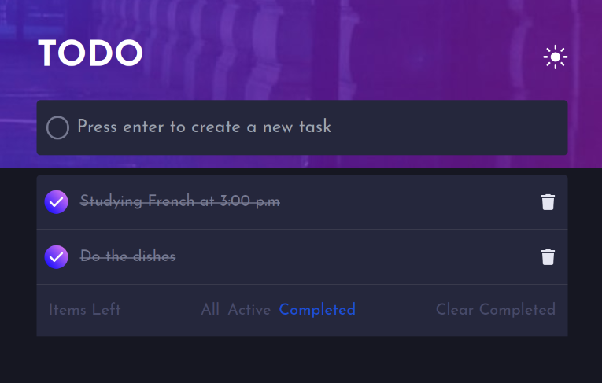

# Todo App built using NextJS and Tailwind

## A Todo APP built using NextJS and TailwindCSS with a theme switcher available

## Functionalities

This Todo App let you create tasks, edit its content and also delete them. You are able to filter all your task and see just the active ones, which meaning that they aren't completed yet, the completed ones or, by default, you'll see all your tasks.

### Create a task

When you are typing in the main input, you can either press enter or click on the circle to create a new task.

### Manage tasks

#### Edit task content

Click on the task textual content and an input will be showed along two buttons: one of them is to confirm the content changing and the other is to cancel the changes, returning to the default layout.

The cancel process could be done click on the 'Escape' key on your keyboard as well.

#### Marking as done

To mark one of your tasks as done you can just click on their circle and a line through will appear on the text content, and also the inner content of the circle will be changed. Clicking on this new symbol will mark the task as uncompleted and the default appearance will be showed again.

Uncompleted task

 

Completed task

 

#### Excluding a task

Just click on the trash icon and you task will be excluded without any questions. Remember, you cannot undo this action.

### Filtering tasks

A special component is included to allows you to filter your tasks and only see what you want. You can only display on your screen the active ones, the completed ones or, by default, all your created tasks.

All tasks

 

Active tasks

 

Completed tasks

 

Filter area

 

Unavailable tasks

 

As you can see, there is a option called _Clear Completed_ and, like the name suggests, you can erase all the tasks that you have created.

#### No available tasks

With there aren't any tasks registered, the following image will appear.

No available tasks

 

## Theme switcher

This project also includes an interesting feature that allows you to change the colors of the application just clicking on the sun/moon icon closest of the app title.

Toggle theme

 

### Dark theme

### Light theme

